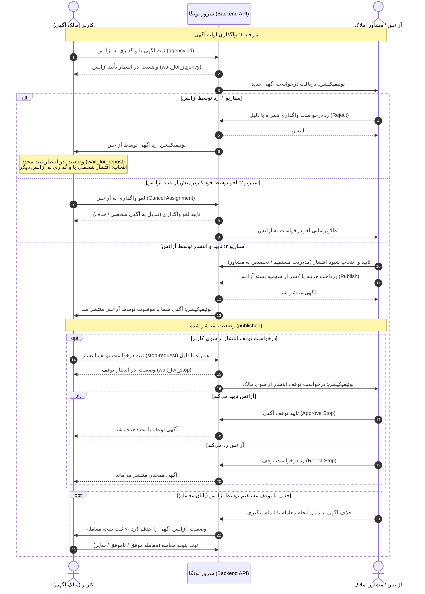

# سند جامع نیازمندی‌های API فرآیند «تخصیص و واگذاری آگهی به آژانس» (Ad Assignment APIs)

این سند کلیه نیازمندی‌ها، متدها، مسیرها (Endpoints)، ساختار داده‌های ورودی و خروجی (Request / Response Payloads) و کدهای وضعیت را برای پیاده‌سازی کامل چرخه حیات **تخصیص آگهی به آژانس املاک** در هر دو سمت **کاربر واگذارکننده (Advertiser/User)** و **آژانس و مشاور (Agency/Consultant)** به تفکیک ارائه می‌دهد.

---

## فهرست مطالب
1. [معماری و چرخه حیات (State Machine & Workflow)](#۱-معماری-و-چرخه-حیات)
2. [جدول نگاشت وضعیت‌ها (Status Mapping)](#۲-جدول-نگاشت-وضعیت‌ها)
3. [APIs سمت کاربر واگذارکننده (User / Advertiser APIs)](#۳-apis-سمت-کاربر-واگذارکننده-user-perspective)
4. [APIs سمت آژانس و مشاور (Agency Perspective APIs)](#۴-apis-سمت-آژانس-و-مشاور-agency-perspective)
5. [تاریخچه و لاگ تغییرات مشترک (Timeline / Activity Log)](#۵-تاریخچه-و-لاگ-تغییرات-timeline--activity-log)
6. [اعلان‌ها و رویدادهای بلادرنگ (Notifications & Events)](#۶-اعلان‌ها-و-رویدادهای-بلادرنگ)
7. [کدهای خطا و اعتبارسنجی (Error Handling)](#۷-کدهای-خطا-و-اعتبارسنجی)

---

## ۱. معماری و چرخه حیات

در پلتفرم بونگا، کاربر عادی هنگام ثبت آگهی می‌تواند انتخاب کند که آگهی به صورت **شخصی** منتشر شود یا به یک **آژانس املاک معتبر** واگذار گردد. همچنین در مراحل پس از ثبت یا پس از انقضا/رد، امکان واگذاری مجدد وجود دارد.

### نمودار توالی فرآیند (Sequence Flow)



---

## ۲. جدول نگاشت وضعیت‌ها (Status Mapping)

| کلید وضعیت کلاینت (`statusKey`) | عنوان فارسی در UI | وضعیت در دیتابیس (`status`) | توضیح |
| :--- | :--- | :--- | :--- |
| `wait_for_agency` | **در انتظار تایید آژانس** | `pending_agency_approval` | آگهی توسط کاربر ثبت و به آژانس ارسال شده ولی هنوز آژانس تایید/رد نکرده است. |
| `wait_for_repost` | **در انتظار ثبت مجدد** | `agency_rejected` | آژانس آگهی را رد کرده است و کاربر باید تصمیم بگیرد (ویرایش، انتشار شخصی یا انتخاب آژانس دیگر). |
| `published` | **منتشر شده** | `published` | آژانس آگهی را تایید، به مشاور یا خود آژانس تخصیص داده و با کسر بسته منتشر کرده است. |
| `wait_for_stop` | **در انتظار توقف انتشار** | `stop_requested` | کاربر دکمه توقف را زده و منتظر تأیید مدیر آژانس است. |
| `wait_for_deal_confirmation` | **ثبت نتیجه درخواست** | `agency_deleted_pending_review` | آژانس آگهی را حذف کرده و کاربر باید اعلام کند ملک معامله شد یا خیر. |
| `archived` | **بایگانی شده** | `archived` | مدت زمان اعتبار انتشار به پایان رسیده است. |
| `deleted` | **حذف شده** | `deleted` | آگهی توسط کاربر یا تایید نهایی حذف شده است. |

---

## ۳. APIs سمت کاربر واگذارکننده (User Perspective)

این APIها با توکن دسترسی کاربر عادی (`Authorization: Bearer <user_token>`) فراخوانی می‌شوند.

### ۳.۱. ثبت یا واگذاری آگهی به آژانس
کاربر می‌تواند هنگام ثبت آگهی جدید یا در ویرایش آگهی، آن را به یک آژانس واگذار کند.

* **آدرس:** `POST /api/v1/me/advertisements/{adId}/assignment`
* **توضیح:** ارسال درخواست واگذاری آگهی به آژانس انتخابی.
* **درخواست (Request Body):**
```json
{
  "target_type": "agency",
  "agency_id": 142
}
```
* **پاسخ (Response 200 OK):**
```json
{
  "status": true,
  "message": "درخواست واگذاری به آژانس با موفقیت ارسال شد.",
  "data": {
    "assignment_id": 1054,
    "advertise_id": 8920,
    "status": "pending",
    "target_type": "agency",
    "agency": {
      "id": 142,
      "name": "آژانس مسکن جلیلیان",
      "logo": "https://api.bonga.ir/storage/agencies/142/logo.png"
    },
    "created_at": "2026-09-27T10:30:00Z",
    "expires_at": "2026-09-28T10:30:00Z"
  }
}
```

---

### ۳.۲. دریافت جزئیات آگهی واگذار شده و وضعیت فعلی
* **آدرس:** `GET /api/v1/me/advertisements/{adId}/assignment-status`
* **توضیح:** این اندپوینت تمام اطلاعات لازم برای رندر کامپوننت `AgencyAssignedUserAdView` را برمی‌گرداند.
* **پاسخ (Response 200 OK):**
```json
{
  "status": true,
  "data": {
    "ad_id": 8920,
    "title": "آپارتمان ۱۴۰ متری نیاوران",
    "category_title": "فروش مسکونی / فروش آپارتمان",
    "thumbnail": "https://api.bonga.ir/storage/ads/8920/thumb.jpg",
    "status": "published",
    "status_title": "منتشر شده",
    "assigned_agency": {
      "id": 142,
      "name": "آژانس مسکن جلیلیان",
      "phone": "02122334455"
    },
    "assigned_consultant": {
      "id": 312,
      "name": "محمدرضا کاظمی",
      "phone": "09123456789",
      "avatar": "https://api.bonga.ir/storage/users/312/avatar.jpg"
    },
    "published_at": "2026-09-24T14:00:00Z",
    "published_time_ago": "۳ روز پیش (۱۴۰۴/۱۱/۰۹)",
    "expires_at": "2026-10-06T14:00:00Z",
    "expires_time_ago": "۱۲ روز دیگر (۱۴۰۴/۱۱/۲۱)",
    "has_pending_stop_request": false,
    "reject_reason": null,
    "deleted_reason": null
  }
}
```

---

### ۳.۳. لغو واگذاری آگهی به آژانس (پیش از تایید آژانس)
در وضعیتی که آگهی `در انتظار تایید آژانس` است، کاربر می‌تواند از طریق باتم‌شیت «لغو واگذاری آگهی به آژانس» فرآیند را لغو کند.

* **آدرس:** `POST /api/v1/me/advertisements/{adId}/assignment/cancel`
* **درخواست (Request Body):**
```json
{
  "cancel_reason": "عدم پاسخگویی آژانس در زمان مقرر",
  "convert_to_personal": false
}
```
* **پارامترها:**
  * `cancel_reason` (string, اختیاری): علت لغو.
  * `convert_to_personal` (boolean, پیش‌فرض `false`): در صورت `true` آگهی به صورت شخصی ثبت می‌شود؛ در غیر اینصورت آگهی به پیش‌نویس یا حذف شده منتقل می‌شود.
* **پاسخ (Response 200 OK):**
```json
{
  "status": true,
  "message": "واگذاری آگهی با موفقیت لغو شد."
}
```

---

### ۳.۴. ارسال درخواست توقف انتشار (هنگام انتشار آگهی)
در وضعیتی که آگهی `منتشر شده` است، کاربر دسترسی حذف مستقیم ندارد (چون آژانس هزینه بسته را پرداخت کرده و مدیریت را بر عهده دارد)، بلکه در صفحه اختصاصی «درخواست توقف انتشار» درخواست می‌دهد.

* **آدرس:** `POST /api/v1/me/advertisements/{adId}/stop-request`
* **درخواست (Request Body):**
```json
{
  "reason": "معامله انجام شده است",
  "description": "با هماهنگی مالک با مشتری دیگری قرارداد بسته شد."
}
```
* **گزینه‌های مجاز `reason`:**
  * `"معامله انجام شده است"`
  * `"دیگر تمایلی به انتشار آگهی ندارم"`
  * `"دلیل دیگری دارم"`
* **پاسخ (Response 200 OK):**
```json
{
  "status": true,
  "message": "درخواست توقف انتشار برای آژانس ارسال شد و پس از بررسی نتیجه اطلاع داده می‌شود.",
  "data": {
    "request_id": 501,
    "ad_id": 8920,
    "status": "pending_agency_decision",
    "created_at": "2026-09-27T14:20:00Z"
  }
}
```

---

### ۳.۵. لغو درخواست توقف انتشار توسط کاربر
اگر کاربر قبل از تصمیم‌گیری آژانس پشیمان شود، می‌تواند درخواست توقف خود را لغو کند تا آگهی به وضعیت عادی منتشر شده بازگردد.

* **آدرس:** `POST /api/v1/me/advertisements/{adId}/stop-request/cancel`
* **پاسخ (Response 200 OK):**
```json
{
  "status": true,
  "message": "درخواست توقف انتشار با موفقیت پس گرفته شد."
}
```

---

### ۳.۶. ثبت نتیجه درخواست / معامله (Deal Outcome)
وقتی آژانس آگهی را برمی‌دارد/حذف می‌کند، در کارت و صفحه آگهی پیام «آژانس این آگهی را حذف کرده است» ظاهر می‌شود و دکمه «ثبت نتیجه درخواست» کاربر را به صفحه ثبت نتیجه هدایت می‌کند.

* **آدرس:** `POST /api/v1/me/advertisements/{adId}/deal-result`
* **درخواست (Request Body):**
```json
{
  "result": "successful",
  "description": "معامله با تلاش مشاور آژانس انجام شد.",
  "deal_type": "sold",
  "feedback_rating": 5
}
```
* **گزینه‌های مجاز `result`:**
  * `"successful"`: معامله موفق بود
  * `"unsuccessful"`: معامله ناموفق بود
* **پاسخ (Response 200 OK):**
```json
{
  "status": true,
  "message": "نتیجه معامله با موفقیت ثبت شد."
}
```

---

### ۳.۷. بازانتشار آگهی به صورت شخصی (Republish as Personal)
در وضعیتی که آگهی توسط آژانس رد شده (`wait_for_repost`) یا منقضی شده (`archived`)، کاربر می‌تواند آگهی را بدون آژانس و با نام شخصی خود منتشر کند.

* **آدرس:** `POST /api/v1/me/advertisements/{adId}/assignment/republish-personal`
* **پاسخ (Response 200 OK):**
```json
{
  "status": true,
  "message": "آگهی به صورت شخصی آماده انتشار شد.",
  "data": {
    "ad_id": 8920,
    "needs_payment": false
  }
}
```

---

### ۳.۸. بازیابی آگهی بایگانی شده (Restore Archived)
* **آدرس:** `POST /api/v1/me/advertisements/{adId}/assignment/restore`
* **پاسخ (Response 200 OK):**
```json
{
  "status": true,
  "message": "آگهی با موفقیت از حالت بایگانی خارج شد."
}
```

---

## ۴. APIs سمت آژانس و مشاور (Agency Perspective)

این APIها با توکن احراز هویت آژانس/مشاور (`Authorization: Bearer <agency_token>`) فراخوانی می‌شوند.

### ۴.۱. لیست درخواست‌های واگذاری ورودی به آژانس
در بخش مدیریت آگهی‌های آژانس (`/account/ad-management`)، تب آگهی‌های دریافتی (تخصیص).

* **آدرس:** `GET /api/v1/me/agency/advertise/assignments`
* **پارامترهای Query:**
  * `page` (number): شماره صفحه (پیش‌فرض ۱)
  * `per_page` (number): تعداد در صفحه (پیش‌فرض ۲۰)
  * `status` (string, اختیاری): `pending` | `approved` | `rejected` | `cancelled`
  * `consultant_id` (number, اختیاری): فیلتر بر اساس مشاور مسئول
* **پاسخ (Response 200 OK):**
```json
{
  "status": true,
  "page": 1,
  "per_page": 20,
  "total": 45,
  "data": [
    {
      "id": 1054,
      "advertise_id": 8920,
      "status": "pending",
      "target_type": "agency",
      "requester_user": {
        "id": 782,
        "name": "علی رضایی",
        "phone": "09121112233"
      },
      "advertise": {
        "id": 8920,
        "title": "آپارتمان ۱۴۰ متری نیاوران",
        "category_title": "فروش آپارتمان",
        "price_total": 14000000000,
        "location": "تهران، نیاوران",
        "created_at": "2026-09-27T10:30:00Z",
        "thumbnail": "https://api.bonga.ir/storage/ads/8920/thumb.jpg"
      },
      "created_at": "2026-09-27T10:30:00Z",
      "expires_at": "2026-09-28T10:30:00Z"
    }
  ]
}
```

---

### ۴.۲. مشاهده جزئیات آگهی جهت بررسی و تصمیم‌گیری (Allocation Review)
صفحه `IndependentConsultantAdAllocationReviewPage` شامل اطلاعات ملک، اطلاعات تماس مالک (`user_phone`)، دکمه‌های تماس تلفنی و چت، پیش‌نمایش و گزینه‌های تصمیم‌گیری.

* **آدرس:** `GET /api/v1/me/agency/advertise/assignments/{assignmentId}`
* **پاسخ (Response 200 OK):**
```json
{
  "status": true,
  "data": {
    "assignment_id": 1054,
    "advertise_id": 8920,
    "status": "pending",
    "advertiser": {
      "user_id": 782,
      "name": "علی رضایی",
      "phone": "09121112233"
    },
    "advertise": {
      "id": 8920,
      "title": "آپارتمان ۱۴۰ متری نیاوران",
      "description": "نورگیر عالی، فول امکانات...",
      "price_total": 14000000000,
      "price_per_meter": 100000000,
      "area": 140,
      "rooms": 3,
      "floor": 4,
      "images": [
        "https://api.bonga.ir/storage/ads/8920/1.jpg"
      ]
    },
    "created_at": "2026-09-27T10:30:00Z"
  }
}
```

---

### ۴.۳. رد واگذاری آگهی توسط آژانس (Reject Assignment)
صفحه `IndependentConsultantAdRejectPage`: آژانس دلیل رد را انتخاب و در صورت تمایل توضیحات ثبت می‌کند.

* **آدرس:** `POST /api/v1/me/agency/advertise/assignments/{assignmentId}/reject`
* **درخواست (Request Body):**
```json
{
  "reject_reason": "قیمت غیرواقعی نسبت به منطقه",
  "note": "قیمت متری اعلام شده ۲۰ درصد بالاتر از میانگین منطقه است."
}
```
* **گزینه‌های متداول `reject_reason`:**
  * `"کیفیت نامناسب یا کمبود تصاویر"`
  * `"اطلاعات ناقص یا متناقض ملک"`
  * `"قیمت غیرواقعی نسبت به منطقه"`
  * `"ملک خارج از محدوده کاری آژانس است"`
  * `"عدم امکان بازدید یا هماهنگی با مالک"`
  * `"سایر دلایل"`
* **پاسخ (Response 200 OK):**
```json
{
  "status": true,
  "message": "درخواست واگذاری آگهی با موفقیت رد شد."
}
```

---

### ۴.۴. تایید واگذاری و تعیین نحوه انتشار (Accept & Assign)
آژانس شیوه مدیریت آگهی را انتخاب می‌کند:
1. **مدیریت مستقیم توسط آژانس** (`target_type: "agency"`)
2. **تخصیص به مشاور مسئول** (`target_type: "consultant"`, `consultant_id: 312`)

* **آدرس:** `POST /api/v1/me/agency/advertise/assignments/{assignmentId}/accept`
* **درخواست (Request Body):**
```json
{
  "target_type": "consultant",
  "consultant_id": 312
}
```
* **پاسخ (Response 200 OK):**
```json
{
  "status": true,
  "message": "آگهی با موفقیت تایید و به مشاور تخصیص یافت. لطفاً فرآیند انتشار را تکمیل کنید.",
  "data": {
    "advertise_id": 8920,
    "status": "pending_payment",
    "ready_to_publish": true,
    "required_credit": 1,
    "agency_remaining_credits": 14
  }
}
```

---

### ۴.۵. انتشار آگهی با کسر از پکیج/اعتبار آژانس (Publish / Checkout)
* **آدرس:** `POST /api/v1/me/agency/advertise/assignments/{assignmentId}/publish`
* **درخواست (Request Body):**
```json
{
  "use_package_credit": true,
  "package_id": 12
}
```
* **پاسخ (Response 200 OK):**
```json
{
  "status": true,
  "message": "آگهی با موفقیت منتشر شد.",
  "data": {
    "advertise_id": 8920,
    "status": "published",
    "published_at": "2026-09-27T14:30:00Z",
    "expires_at": "2026-10-27T14:30:00Z"
  }
}
```

---

### ۴.۶. تغییر مشاور مسئول آگهی منتشر شده
مدیر آژانس در هر زمان می‌تواند مشاور آگهی را تغییر دهد یا به نام خود آژانس برگرداند.

* **آدرس:** `POST /api/v1/me/agency/advertise/assignments/advertise/{adId}/change-consultant`
* **درخواست (Request Body):**
```json
{
  "consultant_id": 405
}
```
*(برای تغییر به مدیریت مستقیم خود آژانس مقدار `consultant_id` برابر با `null` ارسال می‌شود).*

* **پاسخ (Response 200 OK):**
```json
{
  "status": true,
  "message": "مشاور مسئول آگهی با موفقیت تغییر کرد."
}
```

---

### ۴.۷. لیست درخواست‌های توقف انتشار دریافتی از کاربران
آژانس در این بخش لیست کاربرانی که متقاضی توقف آگهی هستند را می‌بیند.

* **آدرس:** `GET /api/v1/me/agency/advertise/stop-requests`
* **پارامترهای Query:** `page`, `per_page`, `status` (`pending`, `approved`, `rejected`)
* **پاسخ (Response 200 OK):**
```json
{
  "status": true,
  "data": [
    {
      "request_id": 501,
      "advertise_id": 8920,
      "user_name": "علی رضایی",
      "user_phone": "09121112233",
      "reason": "معامله انجام شده است",
      "description": "با هماهنگی مالک با مشتری دیگری قرارداد بسته شد.",
      "created_at": "2026-09-27T14:20:00Z"
    }
  ]
}
```

---

### ۴.۸. تایید یا رد درخواست توقف انتشار کاربر توسط آژانس
* **تایید توقف آگهی:** `POST /api/v1/me/agency/advertise/stop-requests/{requestId}/approve`
* **رد توقف آگهی:** `POST /api/v1/me/agency/advertise/stop-requests/{requestId}/reject`
* **درخواست (Request Body):**
```json
{
  "agency_response": "توقف آگهی بلامانع است / قرارداد در شرف انعقاد است."
}
```
* **پاسخ (Response 200 OK):**
```json
{
  "status": true,
  "message": "پاسخ درخواست توقف با موفقیت ثبت شد."
}
```

---

### ۴.۹. حذف یا بستن مستقیم آگهی توسط آژانس
اگر آژانس خودش ملک را فروخت یا تصمیم به توقف گرفت:

* **آدرس:** `POST /api/v1/me/agency/advertisements/{adId}/close`
* **درخواست (Request Body):**
```json
{
  "close_reason": "deal_completed",
  "deal_status": "successful",
  "deal_price": 13800000000,
  "commission_amount": 69000000
}
```
*نکته:* به محض فراخوانی این متد، وضعیت آگهی برای کاربر به `wait_for_deal_confirmation` تبدیل شده و نوتیفیکیشن ثبت نتیجه برای مالک ارسال می‌شود.

---

## ۵. تاریخچه و لاگ تغییرات (Timeline / Activity Log)

هر دو سمت (کاربر در بخش «آخرین تغییرات» و آژانس در پنل مدیریت) نیاز به مشاهده تاریخچه رویدادهای آگهی دارند.

* **آدرس:** `GET /api/v1/me/advertisements/{adId}/timeline`
* **پاسخ (Response 200 OK):**
```json
{
  "status": true,
  "data": [
    {
      "id": 1,
      "type": "assigned_to_agency",
      "title": "واگذاری به آژانس",
      "description": "آگهی توسط کاربر به آژانس مسکن جلیلیان واگذار شد.",
      "actor_name": "علی رضایی (کاربر)",
      "created_at": "2026-09-27T10:30:00Z"
    },
    {
      "id": 2,
      "type": "agency_approved",
      "title": "تأیید توسط آژانس",
      "description": "آگهی توسط آژانس تایید و به مشاور محمدرضا کاظمی تخصیص داده شد.",
      "actor_name": "مدیر آژانس جلیلیان",
      "created_at": "2026-09-27T12:15:00Z"
    },
    {
      "id": 3,
      "type": "published",
      "title": "انتشار آگهی",
      "description": "آگهی در بونگا منتشر شد.",
      "actor_name": "سیستم",
      "created_at": "2026-09-27T14:00:00Z"
    },
    {
      "id": 4,
      "type": "stop_requested",
      "title": "درخواست توقف انتشار",
      "description": "علت: معامله انجام شده است",
      "actor_name": "علی رضایی (کاربر)",
      "created_at": "2026-09-27T15:20:00Z"
    }
  ]
}
```

---

## ۶. اعلان‌ها و رویدادهای بلادرنگ (Notifications & Events)

برای تجربه کاربری روان، رویدادهای زیر باید از طریق **پوش‌نوتیفیکیشن (Web Push / SMS / In-App Notifications)** ارسال گردند:

| کد رویداد | دریافت‌کننده | عنوان پیام | متن پیام |
| :--- | :--- | :--- | :--- |
| `AGENCY_ASSIGNMENT_RECEIVED` | مدیر آژانس | آگهی جدید واگذار شد | آگهی جدیدی برای بررسی و انتشار به آژانس شما واگذار شده است. |
| `AGENCY_ASSIGNMENT_APPROVED` | کاربر مالک | آگهی شما تایید شد | آژانس {agency_name} آگهی شما را تایید و منتشر کرد. |
| `AGENCY_ASSIGNMENT_REJECTED` | کاربر مالک | عدم تایید آگهی | آژانس {agency_name} آگهی شما را به دلیل «{reason}» تایید نکرد. |
| `USER_CANCELLED_ASSIGNMENT` | مدیر آژانس | لغو واگذاری آگهی | متقاضی واگذاری آگهی کد {ad_id} را لغو کرد. |
| `USER_STOP_REQUESTED` | مدیر آژانس / مشاور | درخواست توقف انتشار | مالک آگهی {ad_title} درخواست توقف انتشار ثبت کرده است. |
| `AGENCY_STOP_REQUEST_DECIDED` | کاربر مالک | نتیجه درخواست توقف | آژانس با درخواست توقف انتشار آگهی شما {موافقت/مخالفت} کرد. |
| `AGENCY_REMOVED_AD` | کاربر مالک | آژانس آگهی را حذف کرد | آژانس پیگیری آگهی را به پایان رساند. لطفاً نتیجه معامله را ثبت کنید. |

---

## ۷. کدهای خطا و اعتبارسنجی (Error Handling)

پاسخ‌های ناموفق با کدهای استاندارد HTTP و قالب یکپارچه زیر ارسال می‌شوند:

```json
{
  "status": false,
  "error_code": "ASSIGNMENT_ALREADY_DECIDED",
  "message": "این درخواست قبلاً توسط آژانس تایید یا رد شده است.",
  "errors": {
    "assignment_id": ["شناسه درخواست معتبر نیست."]
  }
}
```

| کد خطای پیشنهادی | کد HTTP | علت بروز خطا |
| :--- | :--- | :--- |
| `AGENCY_NOT_FOUND` | 404 | آژانس انتخاب شده معتبر یا فعال نیست. |
| `INSUFFICIENT_AGENCY_CREDIT` | 402 | اعتبار بسته انتشار آگهی آژانس برای انتشار کافی نیست. |
| `CANNOT_CANCEL_PUBLISHED_AD` | 400 | آگهی منتشر شده را نمی‌توان مستقیماً لغو واگذاری کرد (باید درخواست توقف ثبت شود). |
| `STOP_REQUEST_ALREADY_PENDING` | 409 | قبلاً یک درخواست توقف در انتظار پاسخ برای این آگهی ثبت شده است. |
| `ASSIGNMENT_EXPIRED` | 410 | مهلت ۲۴ یا ۴۸ ساعته آژانس برای بررسی و قبول آگهی منقضی شده است. |
| `UNAUTHORIZED_CONSULTANT` | 403 | مشاور انتخاب شده متعلق به این آژانس نیست. |
