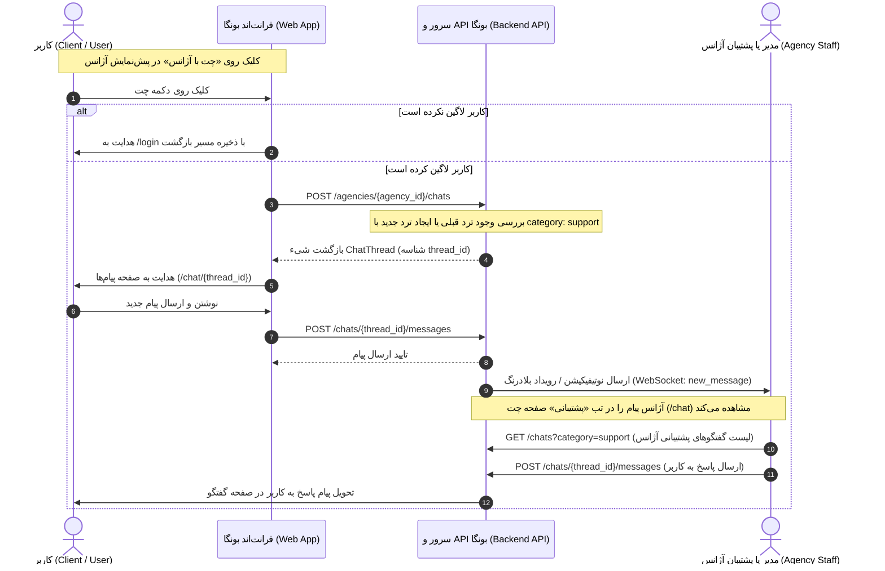

# سند جامع فنی و معماری فرآیند «چت با آژانس» و اتصال به بخش «پشتیبانی» (Agency Chat & Support Workflow)

این سند فرآیند کامل آغاز چت میان کاربر عادی و آژانس املاک از طریق دکمه «چت با آژانس» در صفحه پیش‌نمایش آژانس (`/account/dashboard/agency/preview` یا `/agencies/:id`) و نحوه دریافت، نمایش و مدیریت این گفتگوها در پنل چت آژانس تحت زبانه **«پشتیبانی» (Support)** را تشریح می‌کند.

---

## ۱. چرخه حیات و معماری فرآیند (Architecture & Sequence Flow)

### ۱.۱. سناریو
۱. کاربر عادی وارد صفحه عمومی یا پیش‌نمایش آژانس می‌شود.
۲. با کلیک بر روی دکمه **«چت با آژانس»**، در صورتی که کاربر لاگین نباشد، به صفحه ورود (`/login`) هدایت شده و پس از احراز هویت مجدداً به این صفحه بازمی‌گردد.
۳. در صورت لاگین بودن، درخواست `POST /agencies/{agency_id}/chats` به بک‌اند ارسال می‌شود تا شناسه گفتگو (`thread_id`) ایجاد شده یا در صورت وجود گفتگوی قبلی، همان بازیابی گردد.
۴. کاربر بلافاصله به صفحه گفتگو (`/chat/{thread_id}`) هدایت می‌شود و می‌تواند پیام خود را ارسال کند.
۵. در سمت آژانس (مدیر آژانس یا مشاورینی که دسترسی `support` دارند)، این گفتگو به عنوان یک ترد با دسته‌بندی `category: "support"` در زبانه **«پشتیبانی»** صفحه چت‌ها (`/chat?filter=support`) ظاهر می‌شود.
۶. اعضای مجاز آژانس می‌توانند پیام‌های کاربر را در این بخش مشاهده کرده و به آن پاسخ دهند.

### ۱.۲. نمودار توالی (Sequence Diagram)



---

## ۲. مشخصات و قراردادهای API (API Specifications)

### ۲.۱. ایجاد یا بازیابی گفتگوی آژانس (Start or Get Agency Chat Thread)

- **متد:** `POST`
- **مسیر (Endpoint):** `/agencies/{agency_id}/chats`
- **احراز هویت:** اجباری (`Bearer Token`)
- **توضیحات:** این متد ترد اختصاصی چت بین کاربر جاری و آژانس مشخص‌شده را ایجاد کرده یا در صورت وجود، همان ترد فعال را بازمی‌گرداند. دسته‌بندی این ترد به صورت خودکار `category: "support"` تنظیم می‌شود.

#### پارامترهای مسیر (Path Parameters):
| فیلد | نوع | توضیحات |
| :--- | :--- | :--- |
| `agency_id` | `number` / `string` | شناسه منحصر‌به‌فرد آژانس املاک |

#### نمونه بدنه پاسخ موفق (`200 OK` یا `201 Created`):
```json
{
  "status": true,
  "data": {
    "id": 1052,
    "thread_id": 1052,
    "category": "support",
    "agency_id": 21,
    "user_id": 17,
    "status": "active",
    "created_at": "2026-09-27T15:20:00.000Z",
    "updated_at": "2026-09-27T15:20:00.000Z",
    "participant": {
      "id": 21,
      "name": "آژانس املاک نمونه",
      "avatar": "https://api.bonga.ir/storage/agencies/logo.webp",
      "role": "agency"
    },
    "last_message": null,
    "unread_count": 0
  }
}
```

---

### ۲.۲. دریافت لیست گفتگوهای پشتیبانی آژانس (Agency Support Chats List)

- **متد:** `GET`
- **مسیر (Endpoint):** `/chats`
- **احراز هویت:** اجباری (`Bearer Token` متعلق به مدیر آژانس یا مشاور با دسترسی پشتیبانی)
- **پارامترهای Query:**
  - `category=support` یا `filter=support`
  - `page=1`
  - `per_page=20`

#### نمونه درخواست:
```http
GET /chats?category=support&page=1&per_page=20 HTTP/1.1
Authorization: Bearer <agency_token>
```

#### نمونه پاسخ (`200 OK`):
```json
{
  "status": true,
  "data": [
    {
      "id": 1052,
      "thread_id": 1052,
      "category": "support",
      "agency_id": 21,
      "user_id": 17,
      "participant": {
        "id": 17,
        "name": "علی موسوی",
        "avatar": null,
        "role": "user"
      },
      "last_message": {
        "id": 5401,
        "body": "سلام، درباره شرایط رهن آپارتمان سوال داشتم.",
        "type": "text",
        "is_mine": false,
        "created_at": "2026-09-27T15:22:10.000Z"
      },
      "unread_count": 1,
      "updated_at": "2026-09-27T15:22:10.000Z"
    }
  ],
  "total": 1,
  "page": 1,
  "per_page": 20
}
```

---

### ۲.۳. ارسال پیام در گفتگو (Send Message)

- **متد:** `POST`
- **مسیر (Endpoint):** `/chats/{thread_id}/messages`
- **احراز هویت:** اجباری

#### نمونه بدنه درخواست (Request Body):
```json
{
  "body": "سلام و درود، بفرمایید در خدمت شما هستیم.",
  "type": "text"
}
```

#### انواع معتبر `type`:
- `"text"`: متن پیام
- `"image"`: تصویر
- `"file"`: فایل ضمیمه
- `"location"`: موقعیت مکانی

---

### ۲.۴. علامت‌گذاری پیام‌ها به عنوان خوانده شده (Mark as Read)

- **متد:** `POST`
- **مسیر (Endpoint):** `/chats/{thread_id}/read`

---

## ۳. سطوح دسترسی و مجوزها (Permissions & Authorization)

۱. **کاربران عادی (Regular Users):**
   - به تمام ترد‌هایی که خودشان آغاز کرده‌اند دسترسی دارند (`/chat/{thread_id}`).
   - در لیست چت‌های کاربر، عنوان گفتگو نام آژانس و لوگوی آن خواهد بود.

۲. **مدیر آژانس (`real_estate_manager`):**
   - به کلیه تردهای `category: "support"` متعلق به آژانس خود دسترسی دارد.
   - زبانه «پشتیبانی» در صفحه `/chat` برای وی به صورت پیش‌فرض فعال و قابل انتخاب است.

۳. **مشاورین آژانس (`real_estate_consultant`):**
   - تنها در صورتی که مجوز `support: true` یا `manage_requests: true` در `permissions` مشاور تنظیم شده باشد، زبانه «پشتیبانی» برای او نمایش داده می‌شود و اجازه دسترسی به گفتگوهای مشتریان آژانس را دارد.

---

## ۴. وضعیت پیاده‌سازی در فرانت‌اند (Frontend Implementation)

۱. متد `createOrGetAgencyChat(agencyId)` در `src/features/chat/api/chat.service.ts` اضافه شد.
۲. هوک `useCreateAgencyChatMutation()` در `src/features/chat/api/chat.hooks.ts` اضافه شد.
۳. در کامپوننت `AgencyPreviewPage.tsx` و فوتر آن `AgencyPreviewFooter`:
   - رویداد کلیک دکمه **«چت با آژانس»** متصل گردید.
   - در صورت عدم ورود، کاربر با حفظ آدرس فعلی به لاگین هدایت می‌شود.
   - در صورت ورود، متد شروع چت فراخوانی شده و پس از بازگشت موفق، کاربر به `/chat/{threadId}` ریدایرکت می‌شود.
   - وضعیت بارگذاری (`isChatLoading`) روی دکمه مدیریت می‌شود ("در حال اتصال...").
۴. در صفحه اصلی چت (`src/features/chat/UserChatHomePage.tsx`):
   - فیلتر **«پشتیبانی»** برای مدیران و پرسنل با مجوز پشتیبانی فعال است و داده‌ها را با فیلتر `category=support` فراخوانی و با استایل اختصاصی کارت‌های پشتیبانی رندر می‌کند.
